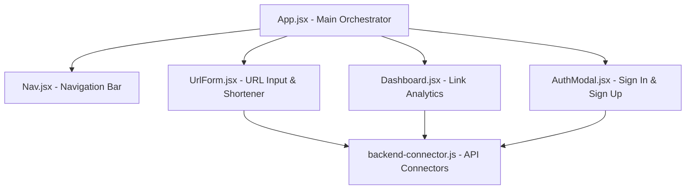

# URL Shortener Responsive UI & Backend Integration Guide

We have built a responsive, dark-mode-themed frontend for a modern URL shortener. Below is a detailed walkthrough of the implementation details, responsive mechanisms, and precise instructions on where to connect your backend API.

---

## 🛠️ Architecture & Core Components



1. **[App.jsx](file:///c:/Users/LENOVO/OneDrive/Desktop/URL%20Shortener/URL-SHORTENER_FRONTED/src/App.jsx)**: Handles global state orchestration (`user` sessions, tabs routing, modal visibility flags, and lists of shortened URLs).
2. **[Nav.jsx](file:///c:/Users/LENOVO/OneDrive/Desktop/URL%20Shortener/URL-SHORTENER_FRONTED/src/components/nav.jsx)**: Premium glassmorphic navigation bar containing responsive navigation links, auth actions, and a mobile collapse button.
3. **[UrlForm.jsx](file:///c:/Users/LENOVO/OneDrive/Desktop/URL%20Shortener/URL-SHORTENER_FRONTED/src/components/UrlForm.jsx)**: Main interface input card supporting original URLs validation, custom aliases toggling, QR code generations, and click tracking.
4. **[Dashboard.jsx](file:///c:/Users/LENOVO/OneDrive/Desktop/URL%20Shortener/URL-SHORTENER_FRONTED/src/components/Dashboard.jsx)**: Private workspace displaying total urls count, total click count metrics, responsive graphs showing top URLs performance, and action controls to copy/delete.
5. **[AuthModal.jsx](file:///c:/Users/LENOVO/OneDrive/Desktop/URL%20Shortener/URL-SHORTENER_FRONTED/src/components/AuthModal.jsx)**: Modal containing registration and login layouts.
6. **[backend-connector.js](file:///c:/Users/LENOVO/OneDrive/Desktop/URL%20Shortener/URL-SHORTENER_FRONTED/src/services/backend-connector.js)**: Holds mock API queries, with placeholders and templates showing how to connect to real endpoints using `fetch` or `axios`.

---

## 🎨 Design System & Responsiveness
- **Style Isolation**: Powered by CSS Modules (e.g. `nav.module.css`, `UrlForm.module.css`, `Dashboard.module.css`) combined with standard responsive flex grids.
- **Glassmorphic Theme**: Defined using CSS custom variables in [index.css](file:///c:/Users/LENOVO/OneDrive/Desktop/URL%20Shortener/URL-SHORTENER_FRONTED/src/index.css), utilizing `backdrop-filter: blur(16px)` and semi-transparent border lines.
- **Mobile Friendliness**: Fully optimized with `@media` breakpoints for screen sizes down to `320px` wide. Mobile screens dynamically convert the navbar into a slide-out drawer menu and stack form/table actions vertically.

---

## 🔗 Where & How to Connect Your Backend

To integrate your backend database and server, follow these simple steps:

### Step 1: Set the API Base URL
In [backend-connector.js](file:///c:/Users/LENOVO/OneDrive/Desktop/URL%20Shortener/URL-SHORTENER_FRONTED/src/services/backend-connector.js#L9), update the `API_BASE_URL` with your server's endpoint:
```javascript
const API_BASE_URL = 'http://localhost:5000/api'; // Replace with your production server URL
```

### Step 2: Implement Real Fetch Requests
Uncomment the placeholder code blocks in [backend-connector.js](file:///c:/Users/LENOVO/OneDrive/Desktop/URL%20Shortener/URL-SHORTENER_FRONTED/src/services/backend-connector.js) and remove the mock localStorage handlers. 

Below are the mapped endpoints:

| Action | HTTP Method | Target API Endpoint | Hook / Component Location |
| :--- | :--- | :--- | :--- |
| **User Login** | `POST` | `/auth/login` | Called inside `handleSubmit` in [AuthModal.jsx](file:///c:/Users/LENOVO/OneDrive/Desktop/URL%20Shortener/URL-SHORTENER_FRONTED/src/components/AuthModal.jsx#L19) |
| **User Sign Up** | `POST` | `/auth/signup` | Called inside `handleSubmit` in [AuthModal.jsx](file:///c:/Users/LENOVO/OneDrive/Desktop/URL%20Shortener/URL-SHORTENER_FRONTED/src/components/AuthModal.jsx#L26) |
| **Shorten URL** | `POST` | `/urls/shorten` | Called inside `handleSubmit` in [UrlForm.jsx](file:///c:/Users/LENOVO/OneDrive/Desktop/URL%20Shortener/URL-SHORTENER_FRONTED/src/components/UrlForm.jsx#L19) |
| **Fetch Links** | `GET` | `/urls/my-urls` | Called inside `useEffect` in [Dashboard.jsx](file:///c:/Users/LENOVO/OneDrive/Desktop/URL%20Shortener/URL-SHORTENER_FRONTED/src/components/Dashboard.jsx#L14) |
| **Delete Link** | `DELETE` | `/urls/:id` | Called inside `handleDelete` in [Dashboard.jsx](file:///c:/Users/LENOVO/OneDrive/Desktop/URL%20Shortener/URL-SHORTENER_FRONTED/src/components/Dashboard.jsx#L38) |
| **Track Clicks** | `GET` | `/r/:alias` | Redirect trigger endpoint (simulated on copy click) |

### Step 3: Authorization (JWT Headers)
If your backend requires user authentication via JWT tokens, store the token upon successful sign-in in `localStorage`. The function `getAuthHeaders` inside [backend-connector.js](file:///c:/Users/LENOVO/OneDrive/Desktop/URL%20Shortener/URL-SHORTENER_FRONTED/src/services/backend-connector.js#L14) automatically attaches this token to the authorization header for subsequent API calls.
